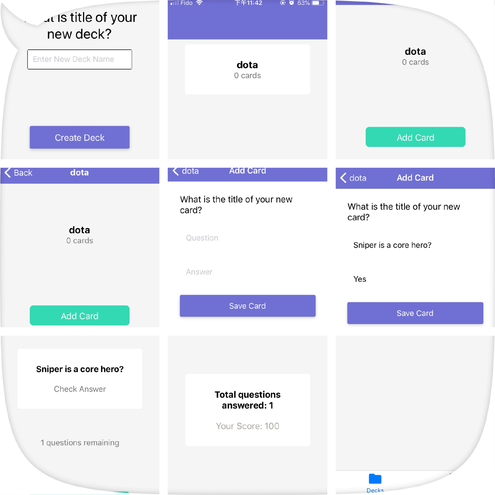

# Project：mobile-flashcards

mobile-flashcards is a mobile application (Android or iOS - or both) that allows users to study collections of flashcards. The app will allow users to create different categories of flashcards called "decks", add flashcards to those decks, then take quizzes on those decks.

The primary purpose of this project is to master the fundamental aspects of building a native application including handling infinite lists, routing, and user input. 


<div  align="center">
Login
</b>
</div>


## Steps to Install
In order to run the application you need:
- Node/npm [[download]](https://nodejs.org/en/)

### Installing

Clone the repo

```
git clone https://github.com/moonfallmaple/mobile-falshcards.git
```

Change into the *mobile-flashcards* project directory

```
cd mobile-falshcards
```

Install project dependencies

```
npm install
```

And start the application

```
npm start
```

Then app will automatically launch in your localhost with a barCode.
Make sure you have download Expo in your mobile device. Then
use your mobile device to scan that bar code
your app will run in your mobile device's Expo.


## Tech Stack
Build your new React Native Project you could start like this:

1 Get the command line tool
```
npm install expo-cli --global
```
2 Create your first project
You will be asked to create an Expo account before proceeding.

```
expo init my-new-project
cd my-new-project
expo start
```
3 Preview your project

```
expo start
```

[`Redux`] is used for state management and [`React Native AsyncStorage`] is used for persistence. 
The data structure :

```
const DEFAULT_STATE = {
  React: {
    title: 'React',
    questions: [
      {
        question: 'What is React?',
        answer: 'A library for managing user interfaces'
      },
      {
        question: 'Where do you make Ajax requests in React?',
        answer: 'The componentDidMount lifecycle event'
      }
    ]
  },
  JavaScript: {
    title: 'JavaScript',
    questions: [
      {
        question: 'What is a closure?',
        answer: 'The combination of a function and the lexical environment within which that function was declared.'
      }
    ]
  }
}


```